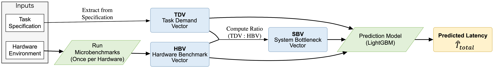

# CTFusion: A Holistic Model for End-to-End Latency Prediction

[](https://opensource.org/licenses/MIT)

This is the official implementation for the paper: **"A Holistic Model for End-to-End Latency Prediction of Deep Learning Tasks on Heterogeneous Systems"** by Yuki Gennai, Yuichi Ohsita, and Hideyuki Shimonishi.

## Abstract

> Due to the explosive growth in Graphics Processing Units (GPUs) demand, decentralized peer-to-peer (P2P) computing marketplaces have emerged, aggregating underutilized GPUs worldwide. Yet their unmanaged, highly heterogeneous hardware and frequent node churn make accurate prediction of end-to-end latency—the total time including CPU/GPU processing and thier ineraction—both indispensable and challenging for deep-learning tasks. Conventional predictors are inadequate: models based solely on GPU kernel execution time ignore CPU-side preprocessing and host–device data transfers, whereas models relying solely on vendor specification sheets fail to capture in-situ performance.

This paper proposes CTFusion (Compute–Transfer Fusion Predictor), a predictive framework that integrates three feature vectors: (i) a Task Demand Vector that quantifies workload intensity; (ii) a Hardware Benchmark Vector derived from lightweight micro-benchmarks; and (iii) a System Bottleneck Vector that captures inter-component imbalance. A Gradient-Boosted Decision Tree learns the non-linear interactions among these vectors.

Evaluated on a dataset from 25 heterogeneous platforms spanning multiple GPU generations, CTFusion attains a mean absolute percentage error of 17.6 % on a hold-out set of unseen hardware, outperforming both catalog-spec (19.7 %) and kernel-centric (29.1 %) baselines. More critically, it improves robustness by reducing the 95th-percentile error by 6.3 percentage points against the catalog-spec baseline.

## Architecture Overview

CTFusion predicts end-to-end latency by fusing three distinct feature vectors: the Task Demand Vector (TDV), the Hardware Benchmark Vector (HBV) derived from a lightweight micro-benchmark suite, and the System Bottleneck Vector (SBV) which quantifies the system imbalance.



## Quick Look: Reproducing Key Results in a Notebook

For those who want to quickly view and verify the main results of our paper, we have prepared a comprehensive Jupyter Notebook.

**This is the fastest way to see our findings without a full setup.**

1.  **Ensure you have Jupyter installed:**
    ```bash
    pip install jupyterlab
    ```
2.  **Launch Jupyter Lab:**
    ```bash
    jupyter-lab
    ```
3.  **Navigate to and open the evaluation notebook:**

    [](https://colab.research.google.com/github/your-username/your-repo/blob/main/notebooks/stgc_evalatoin_all.ipynb)

    **[➡️ Open `notebooks/stgc_evalatoin_all.ipynb`](./notebooks/stgc_evalatoin_all.ipynb)**

The notebook uses the pre-computed experimental outputs stored in the `experiments/outputs/` directory to generate all key tables and figures from our paper. If you wish to re-generate these outputs from scratch, please proceed to the detailed installation and usage sections below.

## Getting Started

### Requirements

- Python 3.9+
- PyTorch (with CUDA support)
- Other dependencies are listed in `requirements.txt`.

### Installation

1.  **Clone the repository:**

    ```bash
    git clone https://github.com/your-username/CTFusion-Latency-Prediction.git
    cd CTFusion-Latency-Prediction
    ```

2.  **Create a virtual environment (recommended):**

    ```bash
    python -m venv venv
    source venv/bin/activate  # On Windows, use `venv\Scripts\activate`
    ```

3.  **Install the main dependencies:**

    ```bash
    pip install -r requirements.txt
    ```

4.  **Install the benchmark suite:**  
    The micro-benchmark suite is a separate package. For details on its usage and dependencies, please refer to its own README.

    ```bash
    cd benchmark_suite
    pip install -r requirements.txt
    pip install .  # Install the suite as a package
    cd ..
    ```

    (Note: Using -e . installs the package in "editable" mode, which is convenient for development.)

    For detailed information on the benchmark suite's configuration and usage, please refer to its dedicated [Benchmark Suite README](./benchmark_suite/README.md).

## Usage

### How to Run Experiments

All experiments are managed via YAML configuration files located in the `experiments/configs/` directory. You can run any experiment using the main `train.py` script.

**Example: Running the main CTFusion experiment**

```bash
python train.py --config experiments/configs/exp001_holdout_ctfusion.yml
```

This script will:

1.  Load the settings from the specified config file.
2.  Train the model.
3.  Save all outputs (trained model, predictions, metrics) into a timestamped directory inside `experiments/outputs/`.

## Reproducing Paper Results

To reproduce the key results (tables and figures) reported in our paper, follow these steps:

### Step 1: Prepare the Dataset

First, ensure that the raw data (hardware benchmarks, model specs, etc.) is placed in the `data/00_raw` and `data/01_catalog` directories as described in the paper. Then, run the data processing script to generate the final dataset used for training.

```bash
python -m ctfusion.data.make_dataset
```

This will create `stgc_dataset.csv` in `data/02_processed/`.

### Step 2: Run All Experiments

Run the training script for all 5 experiment configurations to generate the outputs for CTFusion, baselines, and ablation studies.

```bash
# This will run all experiments defined in the configs directory
for config in experiments/configs/*.yml; do
  python train.py --config "$config"
done
```

### Step 3: Analyze the Results

After all experiments are complete, run the main evaluation notebook. This will parse the output files, calculate the final metrics, and generate the figures presented in the paper.

1.  Start Jupyter Notebook or Jupyter Lab.
2.  Open and run `notebooks/stgc_evalatoin_all.ipynb`.

## Repository Structure

```
.
├── benchmark_suite/    # The standalone micro-benchmark suite
├── ctfusion/           # Main Python source code for the CTFusion framework
├── data/               # Datasets (Raw, Catalog, Processed)
├── experiments/        # Experiment configurations and outputs (STGC 2025)
│   ├── configs/        # YAML files defining each experiment
│   └── outputs/        # Generated results (models, predictions, etc.)
├── notebooks/          # Jupyter notebooks for analysis and visualization
├── train.py            # Main script to launch training experiments
└── README.md           # This file
```

## License

This project is licensed under the MIT License. See the [LICENSE](./LICENSE) file for details.
